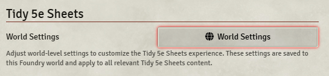

# Alignment Drift Tracker

A Foundry VTT module for tracking custom alignment paths (Corruption, Radiance, and Balance) in Tidy UI.

## Installation

1. In Foundry VTT, navigate to the Add-on Modules tab
2. Click "Install Module"
3. In the Manifest URL field, paste: `https://raw.githubusercontent.com/ivandrenjanin/alignment-drift-tracker/main/module.json`
4. Click "Install"

## Requirements

- Foundry VTT v12
- Tidy5e Sheet module

## Features

- Tracks custom alignment paths: Corruption, Radiance, and Balance
- Integrates with Tidy5e Sheet
- Customizable tracking system

## Usage

1. Enable the module in your world settings
2. The alignment tracker will be available in the character sheet once enabled in Tidy Sheet settings:

3. Track your character's alignment drift through the three paths

## How the System (should) Work

The Alignment Drift Tracker adds a custom tab to each character sheet, allowing you to track three alignment paths: **(Evil) Corruption**, **(Good) Radiance**, and **(Neutral) Balance**. Each path has its own counter and visual tracker.

**Drift Points**: Each path can have up to 13 points. Use the plus (+) and minus (–) buttons to adjust the value for each path. The total drift points are shown at the top.

**Dominant Trait**: This is a free-text field where you can describe the character's current dominant trait. Click and edit the field to update it; changes are saved automatically.

**Fate Roll (d20 button)**: Each path has a small d20 button. Clicking it rolls 3 Fate dice (3df) and posts the result to chat. If the roll is a "success" for that path (Corruption: two minuses, Radiance: two pluses, Balance: two blanks), the chat message is highlighted in a color matching the path.

**Integration**: The tracker is fully integrated with the Tidy5e Sheet.

This system is designed to help GMs and players track and visualize a character's moral or metaphysical drift over time, with quick tools for both mechanical and narrative tracking. Everything is up to the interpretations of the GM, but I will be adding my own system rules as well once done.

## TODO
- [ ] Respect sheet permissions (if the sheet is not editable, the controls are disabled)
- [ ] Better Dominant Trait Explanation/Lore instead of free text range as it is now.
- [ ] Better and expanded system rules with in-game consequences.
- [ ] Fate Die Rolls sometimes duplicate.

## License

This module is licensed under the MIT License.

## Support

For support, please visit the [GitHub repository issues](https://github.com/ivandrenjanin/alignment-drift-tracker/issues) or contact me on Discord: zaramao 
